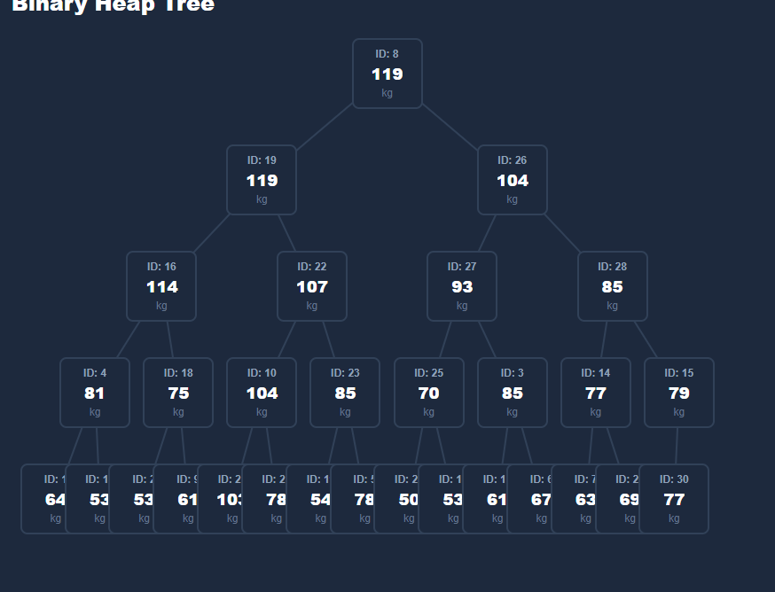
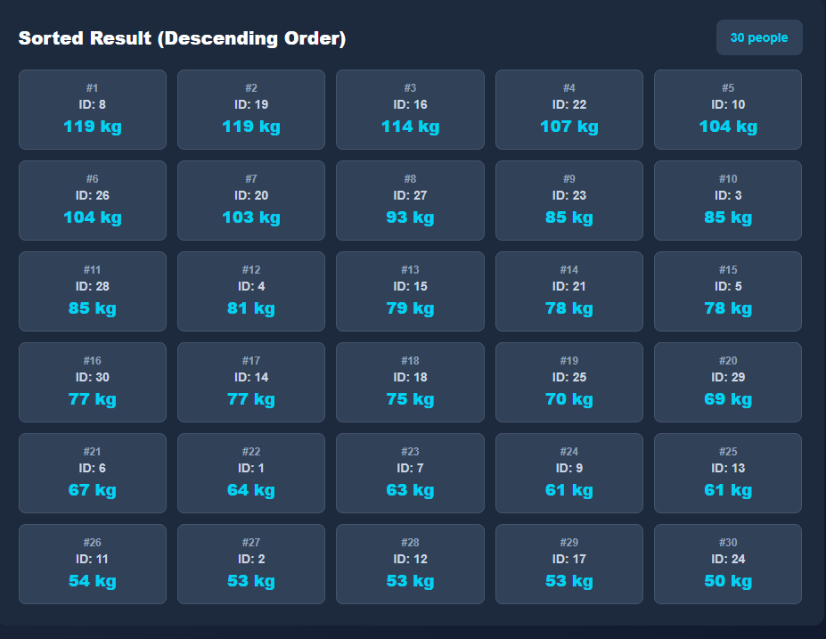
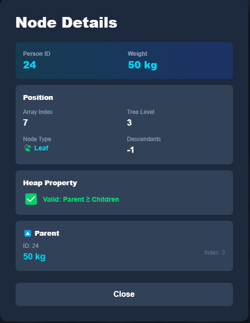
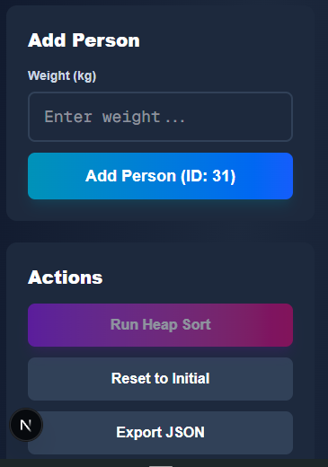
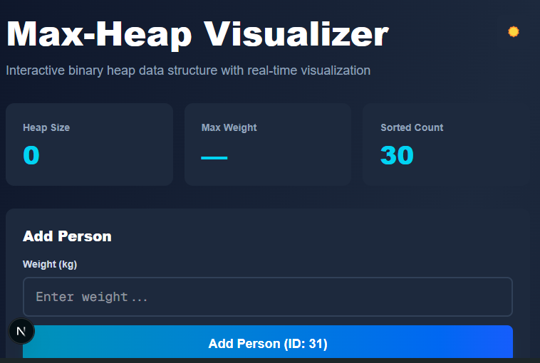
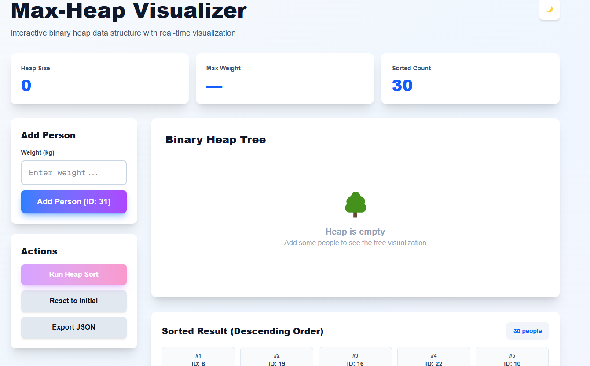

# Max-Heap Sort Visualization

An interactive, real-time visualization tool for understanding Max-Heap data structures and Heap Sort algorithms. Built with Next.js, React, and Framer Motion for smooth, educational animations.


---

## 📋 Table of Contents

- [Features](#-features)
- [Installation & Setup](#-installation--setup)
- [Usage](#-usage)
- [Screenshots](#-screenshots)

---

## ✨ Features

### Core Functionality

**🌳 Interactive Heap Visualization**

- Real-time binary tree visualization of max-heap structure
- Visual parent-child relationships with animated connections
- Click any node to view detailed information (position, level, parent/children, heap property validation)

**➕ Person Addition with Animation**

- Add people with custom weights (1-300 kg)
- Step-by-step heapify-up visualization
- Color-coded operations:
  - 🟡 **Yellow**: Comparing nodes
  - 🟢 **Green**: Swapping nodes
  - 🔵 **Cyan**: Highlighting current operation

**🔄 Heap Sort with Playback Controls**

- Automated heap sort with full visualization
- **Playback Controls:**
  - ▶️ Play/Pause sorting
  - ⏮ Step backward
  - ⏭ Step forward
  - 🎚️ Adjustable speed (0.25x - 3x)
  - 📊 Progress bar with step counter
- Real-time sorted list display (descending order by weight)
- Complete extraction and heapify-down animations

**🎨 User Interface**

- 🌓 Dark/Light mode toggle
- 📱 Fully responsive design (mobile, tablet, desktop)
- 🎭 Smooth animations with Framer Motion
- ♿ Accessible UI with proper ARIA labels
- 💾 Export heap data as JSON

**📊 Statistics Dashboard**

- Current heap size
- Maximum weight (root node)
- Sorted items count
- Real-time updates

### Advanced Features

**📖 Educational Node Details Modal**
When clicking any node, view:

- Person ID and weight
- Array index and tree level
- Node type (Root 👑, Internal 🌿, or Leaf 🍃)
- Number of descendants
- Parent node information (if applicable)
- Left/Right child information (if applicable)
- Heap property validation (✅/❌)

**🎯 Input Validation**

- Positive integers only (1-300 kg)
- User-friendly error messages
- Real-time validation feedback

---

## 🚀 Installation & Setup

### Prerequisites

- **Node.js** 18.0 or higher
- **npm** 9.0 or higher (or **yarn** 1.22+)

### Installation Steps

1. **Clone the repository**

   ```bash
   git clone <repository-url>
   cd react-heap-sort-visualization/my-app
   ```

2. **Install dependencies**

   ```bash
   npm install
   ```

3. **Start development server**

   ```bash
   npm run dev
   ```

4. **Open in browser**
   ```
   http://localhost:3000
   ```

### Production Build

```bash
# Build for production
npm run build

# Start production server
npm start
```

### Other Commands

```bash
# Run linter
npm run lint

# Run type checking (if using TypeScript)
npm run type-check
```

---

## 📖 Usage

### Basic Operations

1. **Adding a Person**
   - Enter weight in kg (1-300)
   - Click "Add Person"
   - Watch heapify-up animation
   - New person bubbles up to correct position

2. **Running Heap Sort**
   - Click "Run Heap Sort"
   - Use playback controls to navigate:
     - Play/Pause to control flow
     - Step Back/Forward for detailed analysis
     - Adjust speed for learning pace
   - Watch sorted list grow in real-time

3. **Inspecting Nodes**
   - Click any node in the tree
   - View comprehensive node information
   - Understand parent-child relationships
   - Verify heap property is maintained

4. **Managing Data**
   - "Reset to Initial" - Restore 30 default people
   - "Export JSON" - Save current state
   - Toggle dark/light mode for comfort

---

## 📸 Screenshots

### 1. Initial State - 30 Person Max-Heap Tree



_The application loads with 30 pre-populated people, organized as a max-heap by weight_

**Features shown:**

- Binary tree layout with proper spacing
- Node connections (parent-child relationships)
- Person ID and weight displayed on each node
- Root node shows maximum weight
- Statistics dashboard showing heap size
- Dark mode theme

---

### 2. Adding a New Person - Heapify-Up Animation


_Adding a person with 120 kg weight - watch it bubble up through the heap_

**Animation sequence:**

1. **Insert at bottom** (highlighted in cyan)
2. **Compare with parent** (both nodes turn yellow)
3. **Swap if needed** (nodes turn green, animate position)
4. **Repeat until correct position** (multiple compare/swap cycles)
5. **Final position** (highlighting removed)

**Timing:**

- Initial highlight: 500ms
- Compare operation: 600ms (yellow)
- Swap operation: 800ms (green)
- Total animation: 3-5 seconds depending on heap depth

---

### 3. Heap Sort Process - Step-by-Step Visualization


_Complete heap sort visualization with playback controls_

**What's shown:**

1. **Extraction Phase:**
   - Root (maximum) highlighted in (cyan/blue)
   - Moves to sorted list

2. **Heapify-Down Phase:**
   - Last element becomes new root
   - Compares with children (yellow)
   - Swaps with largest child (green)
   - Repeats until heap property restored

3. **Playback Controls:**
   - Progress bar (Step 45 of 108)
   - Play/Pause button
   - Step backward/forward
   - Speed slider (0.5x shown)

---

### 4. Final Sorted List - Descending Order



_All 30 people sorted by weight in descending order_

**Display format:**

- Rank number (#1, #2, #3...)
- Person ID
- Weight in kg
- Grid layout (responsive: 2-5 columns based on screen size)
- Animated appearance (items fade in sequentially)

---

### 5. Node Details Modal - Educational View



_Clicking on a node shows comprehensive information_

**Information displayed:**

- **Person Info:** ID and weight
- **Position:** Array index, tree level, node type, descendants count
- **Heap Property:** Validation with ✅/❌ indicator
- **Parent:** ID, weight, and array index
- **Children:** Left and right child details with indices

---

### 6. Mobile Responsive Design

<div style="display: flex; gap: 20px;">
  
  
</div>

_Fully responsive across all devices_

**Responsive features:**

- Mobile: Single column layout, touch-friendly controls
- Tablet: Adaptive grid (2-3 columns)
- Desktop: Full multi-column layout (up to 5 columns)
- Tree scales horizontally for better viewing

---

### 7. Light Mode Theme



_Toggle between dark and light themes with smooth transitions_
